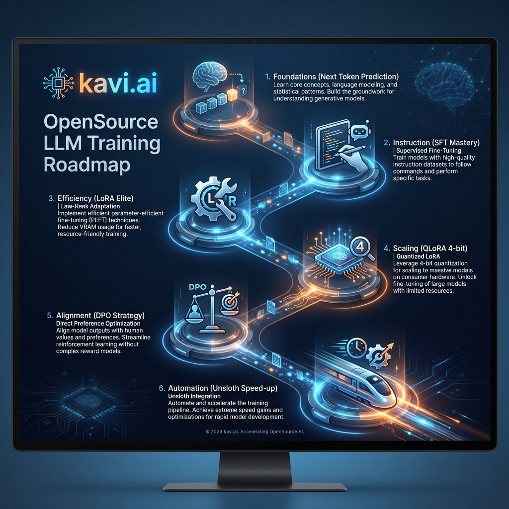

<div align="center">
  
  <br>
  
  # 🧠 OpenSource LLM Training Workshop
  ### **The Executive Guide to Efficient Fine-Tuning & Alignment**
  **Architected by kavi.ai | Lead: Machha Kiran**

  [](https://opensource.org/licenses/MIT)
  [](https://huggingface.co/models)
  [](https://wandb.ai/)
  []()

  ---
  **Bridge the gap between raw compute and production-grade intelligence. Master state-of-the-art PEFT, SFT, and Preference Optimization with a curriculum built for the elite AI Engineer.**
</div>

## 📌 **Strategic Roadmap**
- [💎 The kavi.ai Philosophy](#-the-kaviai-philosophy)
- [🏗 Training Curriculum](#-training-curriculum)
- [🚀 Strategic Techniques & Enterprise Use Cases](#-strategic-techniques--enterprise-use-cases)
- [📍 Training Roadmap](#-training-roadmap)
- [Overview](#-overview)
- [📚 Resource Library (Lecture Slides)](#-resource-library-lecture-slides)
- [⚡ Rapid Deployment](#-rapid-deployment)

---

## 💎 **The kavi.ai Philosophy**
At **kavi.ai**, we believe that *Efficiency is the new Intelligence*. This workshop isn't just about code—it's about the **strategic selection of training methodologies**. We focus on:
- **Parameter Efficiency**: Doing more with 1% of the weights.
- **Hardware Agnostic Scaling**: Turning consumer GPUs into LLM factories.
- **Human-Centric Alignment**: Ensuring AI agents remain helpful, honest, and harmless.

---

## 📍 **Training Roadmap**
<div align="center">
  
  <p><i>A visual guide to mastering the Open-Source LLM ecosystem.</i></p>
</div>

---

## 🏗 **Training Curriculum**

| Track | Module | Strategic Value | Link |
| :--- | :--- | :--- | :--- |
| **Foundations** | **01: Base Modeling** | Mastering the "Next Token Prediction" engine. | [Learn Foundations](./01-language-model-and-the-basics-of-training/training-language-model-from-scratch.ipynb) |
| **Instruction** | **03: SFT Mastery** | Directing model behavior via supervised sets. | [Master SFT](./03-sft-and-training-tricks/00-train-sft.ipynb) |
| **Efficiency** | **03: LoRA Elite** | Training 7B+ models on 16GB VRAM. | [Configure LoRA](./03-sft-and-training-tricks/02-train-with-lora.ipynb) |
| **Scaling** | **03: QLoRA 4-bit** | Precision fine-tuning on highly compressed weights. | [Deploy QLoRA](./03-sft-and-training-tricks/03-qlora-training.ipynb) |
| **Alignment** | **04: DPO Strategy** | High-speed preference alignment without Reward Models. | [Direct Alignment](./04-dpo-orpo/01-train-with-dpo.ipynb) |
| **Automation** | **05: Acceleration** | Maximizing throughput and training velocity. | [Speed Training](./05-training-acceleration/03-unsloth-accelerated-training.ipynb) |

---

## 🚀 **Strategic Techniques & Enterprise Use Cases**

### 🎯 **Supervised Fine-Tuning (SFT)**
- **Strategic Purpose**: Bootstrapping pre-trained models for specific task adherence.
- **Enterprise Case**: Building highly specialized **Legal or Medical AI** that must speak with professional precision and follow rigid departmental guidelines.
- **kavi.ai Insight**: SFT is the "education" stage. It defines what the model *knows* how to do.

### 🏎 **LoRA (Low-Rank Adaptation)**
- **Strategic Purpose**: Modifying internal weights via low-rank decomposition.
- **Enterprise Case**: **Dynamic Personalization**—deploying 100+ different adapters (one for each client) on a single shared base model to reduce infrastructure costs by 90%.
- **kavi.ai Insight**: MB-sized weights allow for "hot-swapping" intelligence in real-time.

### 🛡 **QLoRA (Quantized LoRA)**
- **Strategic Purpose**: 4-bit weight compression combined with 16-bit gradient updates.
- **Enterprise Case**: Fine-tuning **Llama-3 70B** on individual employee workstations for extreme privacy and cost efficiency.
- **kavi.ai Insight**: QLoRA is the key to local-first AI development.

### ⚖ **DPO (Direct Preference Optimization)**
- **Strategic Purpose**: Mathematically aligning model outputs with human feedback.
- **Enterprise Case**: **Safety & Brand Alignment**—ensuring customer service bots never hallucinate pricing or violate DEI protocols by training on historical "Chosen" vs. "Rejected" logs.
- **kavi.ai Insight**: Skips the instability of PPO for faster, production-ready alignment.

---

## 📚 **Resource Library (Lecture Slides)**
Deep dive into the theory with our professional slide decks:
- [📂 Module 01: Transformers & Base Training](../Training-OpenSource-LLMs-Lectures-slides/01-Language-Models-and-the-basics-of-training/)
- [📂 Module 02: SFT & PEFT Innovation](../Training-OpenSource-LLMs-Lectures-slides/02-supervised-fine-tuning/)
- [📂 Module 03: The DPO & Alignment Frontier](../Training-OpenSource-LLMs-Lectures-slides/03-Preference-Alignment/)

---

## ⚡ **Rapid Deployment**

1. **Initialize Workspace**:
   ```bash
   git clone https://github.com/machhakiran/opensource-taining-llms
   ```
2. **Setup Dependencies**:
   ```bash
   pip install -r requirements.txt
   ```
3. **Ignite Training**:
   Launch any notebook in your preferred IDE and leverage the **Enterprise Use Cases** provided inside to build your next generation of AI agents.

---
<div align="center">
  <p><b>kavi.ai - A Team of 4 Brains</b></p>
  
</div>
